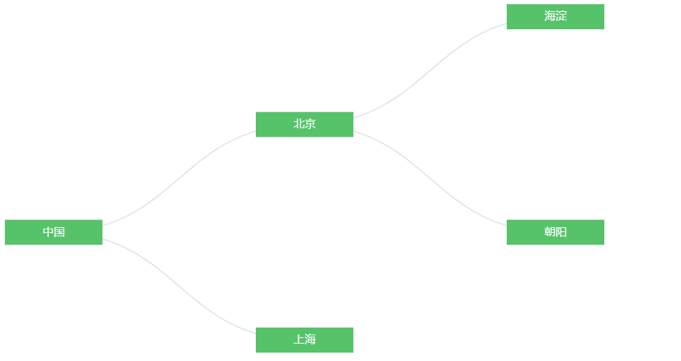

## 结果预览


## vue 和 d3 的角色
画图可分为两步：

1. 元素坐标计算
2. 数据绑定

坐标计算只需要一些 api，本文使用 d3。  
数据绑定既可以借助 d3，也可以使用 vue。d3 通过操作 dom 实现，有点像 jQuery，d3 针对数据和 dom 的状态提出了三个概念：Update、Enter、Exit，感兴趣的可以看官网。本文使用 vue 做数据绑定  

总结：使用 d3 提供的 api 计算元素坐标，使用 vue 进行数据绑定

## 坐标计算
一棵树有节点和连接构成，只需要计算出这两种元素的坐标即可  

画一棵树常见的有两种数据结构，一种是嵌套的，一种是扁平的。如下：

```javascript
// 嵌套的
var treeData = {
    name: '中国',
    children: [{
        name: '北京',
        children: [{
            name: '海淀'
        }, {
            name: '朝阳'
        }]
    }, {
        name: '上海'
    }]
};
// 扁平的
var flattenData = [{
    name: '中国',
    parent: ''
}, {
    name: '北京',
    parent: '中国'
}, {
    name: '上海',
    parent: '中国'
}, {
    name: '海淀',
    parent: '北京'
}, {
    name: '朝阳',
    parent: '北京'
}]
```

对于嵌套的数据，使用 d3.hierarchy() 计算坐标，对于扁平的，使用 d3.stratify()。得到的结构如下(列举根节点)：

```javascript
var hierarchyNode = {
    depth: 0
    height: 2
    parent: null
    x: 60
    y: 0,
    data: {
       name: "中国"，
       children: [] 
    },
    children: []
};
```
得到根节点后使用 descendants() 获取所有节点信息，links() 获取所有连接信息。节点的结构如上述，连接结构如下：

```javascript
var link = {
    source: Node,
    target: Node
}
```

至此，已获取到所有元素的坐标

## 数据绑定
使用 svg  

树的节点就是 rect + text，如下：

```html
<g :transform="rootTransform">
    <rect :width="nodeWidth" :height="nodeHeight" :fill="nodeFill"></rect>
    <text :fill="nodeTextColor" text-anchor="middle" dominant-baseline="middle"
        :y="nodeHeight / 2" :x="nodeWidth / 2">{{node.data.name}}</text>
</g>
```

连接就是 path，如下：

```html
<g>
    <path :d="getLinkPath(link)" :stroke="linkStroke" fill="none" :stroke-width="linkStrokeWidth"></path>
</g>
```
## code
> talk is cheap show me the code

